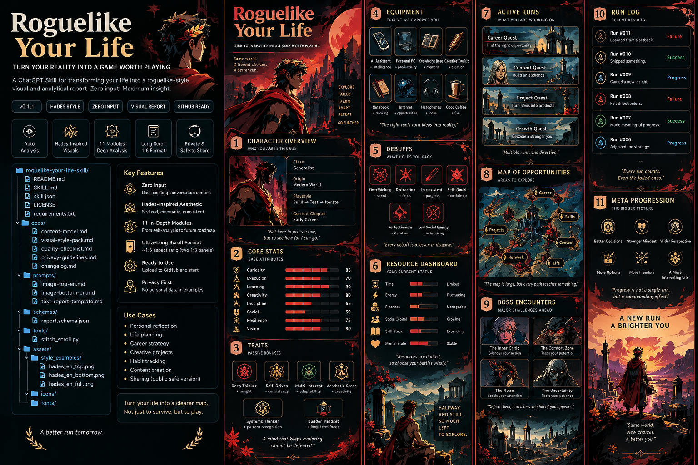

# Roguelike Your Life

Turn an AI chat that already knows you into a **roguelike-style life save report**: character build, core stats, relics, debuffs, active runs, boss encounters, failure drops, and meta progression — then render it as an ultra-long visual scroll.

> **Zero-input first.** If the AI already has enough conversation context, memory, project history, or personal working context, it should analyze that material directly instead of asking the user to fill out another questionnaire.



## What it produces

- An English analytical report with the fixed title `ROGUELIKE YOUR LIFE`
- 11 visual modules grounded in the user's real current state
- A reality analysis, not generic motivational advice
- A target **1:6 long-scroll poster**, preferably generated as two continuous 1:3 panels and stitched vertically
- A default **Hades-inspired mythic underworld action-roguelike direction**, using original generated assets only

## Quick start

### In a context-aware Chat AI

Give the AI this repository — at minimum `SKILL.md` — and say:

> Use the Roguelike Your Life skill to generate my current life save report and long-scroll poster.

If the AI already has enough long-term context, no additional input should be required.

### In Codex or an agent without long-term memory

Provide relevant chat exports, project summaries, a resume, notes, or a current-state brief alongside `SKILL.md`. If evidence is missing, the skill should mark the section as uncertain instead of inventing details.

## Repository structure

```text
roguelike-your-life-skill/
├─ README.md
├─ SKILL.md
├─ skill.json
├─ LICENSE
├─ CHANGELOG.md
├─ requirements.txt
├─ docs/
│  ├─ content-model.md
│  ├─ visual-style-pack.md
│  ├─ quality-checklist.md
│  └─ public-release-privacy.md
├─ prompts/
│  ├─ image-top-en.md
│  ├─ image-bottom-en.md
│  └─ text-report-template.md
├─ schemas/
│  └─ report.schema.json
├─ tools/
│  └─ stitch_scroll.py
├─ assets/
│  └─ style_examples/
│     └─ public_preview_en.png
└─ examples/
   └─ README.md
```

## Design principles

1. **Model reality before gamifying it.** Never invent achievements, skills, relationships, users, or traction for the sake of a cooler report.
2. **Separate facts from inference.** Inferences are allowed, but confidence should be controlled explicitly.
3. **Every run gets a settlement.** A failed run may still yield information, skill, reusable assets, trust, or resource changes.
4. **Do not default to advice.** The default output is a state report. Strategy is only added when the user asks for it.
5. **Bosses are state transitions.** A boss should represent a milestone that meaningfully changes the opportunity set of later runs.
6. **The scroll must feel like a scroll.** On mobile, one viewport should contain roughly 1–1.5 major modules.

## Visual identity

The default look is a mythic underworld action-roguelike interface inspired by the energy of Hades: black stone, crimson fire, warm gold, laurel motifs, temple architecture, heroic portraits, sharp iconography, and strong readable panels.

This repository does **not** bundle official game screenshots, logos, fonts, or proprietary artwork. The included public preview is an original AI-generated example.

## Privacy

Public examples must be fictional or anonymized. Do not publish real names, personal handles, private companies or projects tied to a user, precise locations, financial figures, exact identifying dates, application status, private rankings, credentials, or screenshots from private conversations.

See `docs/public-release-privacy.md`.

## Maintenance and contact

This is a small, single-maintainer skill pack. Issues and pull requests are welcome, but responses may take time. For security reports or time-sensitive questions, email `lucaszhouc@gmail.com`.

The package is published directly from the repository without numbered releases or version tags.
